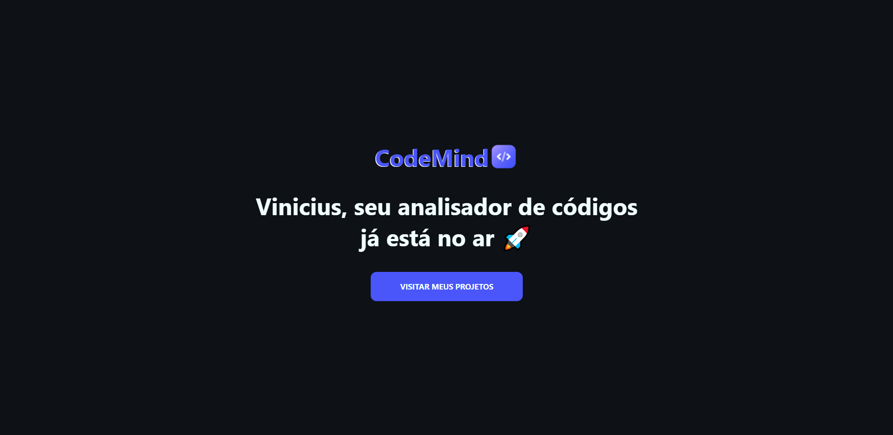
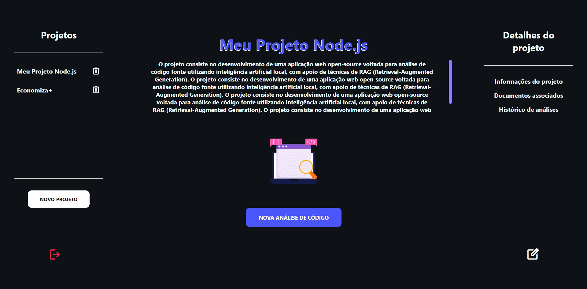
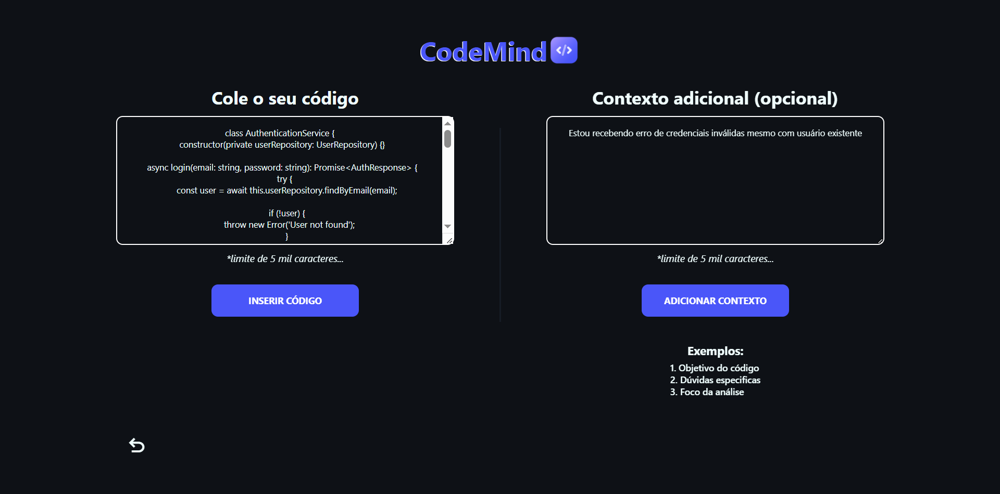
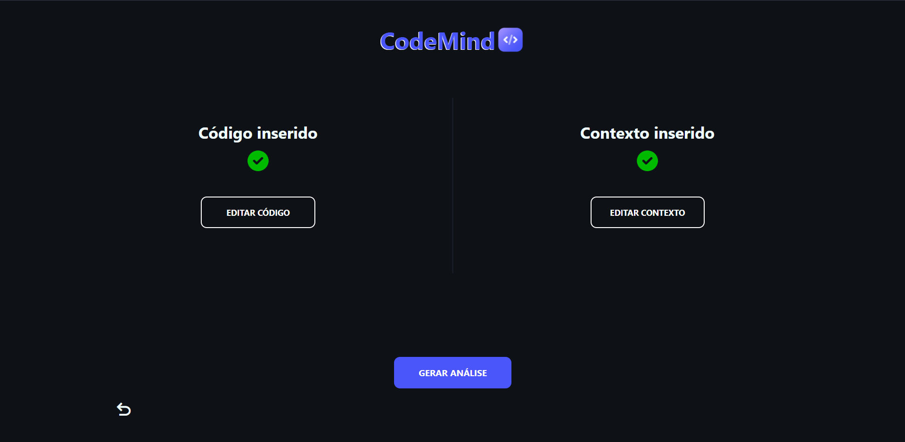
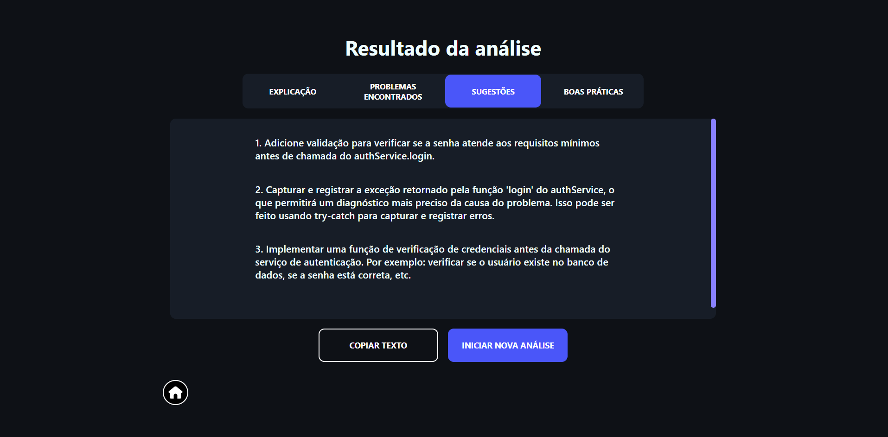

## 💻 CodeMind — Analisador de Código com IA Local e RAG

O **CodeMind** é uma plataforma **open-source** para **análise técnica de código-fonte** utilizando AI Local integrada a um pipeline de RAG (Retrieval-Augmented Generation).

Diferente de um chatbot tradicional, o CodeMind é um **analisador especializado**, capaz de reutilizar o contexto de cada projeto através de documentos previamente enviados pelo usuário, produzindo análises mais consistentes, contextualizadas e voltadas para boas práticas de desenvolvimento.

Toda a aplicação funciona **localmente**, preservando a privacidade dos dados e eliminando a dependência de APIs externas.

---

## 🔒 Privacidade em primeiro lugar
O CodeMind foi desenvolvido para que todo o processamento aconteça na **máquina do usuário**.
- 🔐 Nenhum código é enviado para serviços externos
- 🤖 IA executada localmente com Ollama
- 📁 Documentos permanecem armazenados localmente
- ⚡ Menor latência
- 🌐 Funcionamento totalmente offline
- 💰 Sem custo por utilização de APIs

## 🎯 Objetivo do projeto
O principal objetivo do CodeMind é **auxiliar desenvolvedores** durante o processo de desenvolvimento de software através de **análises técnicas contextualizadas**.

Ao invés de analisar apenas um trecho isolado de código, o sistema **utiliza o contexto do projeto** para produzir respostas mais relevantes.

Entre seus principais objetivos estão:
- 💡 Explicar o funcionamento do código
- 📖 Auxiliar no aprendizado de boas práticas
- 🔍 Identificar possíveis problemas
- 🚀 Sugerir melhorias estruturais
- 🧠 Reutilizar conhecimento do próprio projeto utilizando RAG
- 🔒 Garantir privacidade através de IA Local

## 🚀 Principais funcionalidades

### 👤 Gerenciamento de usuário
- Cadastro local
- Sem autenticação online
- Persistência local
- Edição de perfil

### 📁 Gerenciamento de projetos
Cada análise pertence obrigatoriamente a um projeto.
Cada projeto possui:
- Nome
- Descrição
- Tipo da aplicação
- Linguagens
- Frameworks
- Propósito
- Ambiente de execução

Essas informações são utilizadas para **personalizar o comportamento da IA** durante as análises.

### 📄 Gerenciamento de documentos
Os projetos podem receber diversos documentos, como:
- Código fonte
- README
- Arquiteturas
- Documentações
- Especificações técnicas

Após o envio, esses documentos são:
- armazenados
- convertidos em embeddings
- indexados
- utilizados pelo pipeline de RAG

### 🤖 Análise de código
O usuário pode iniciar uma nova análise através de:
- Colagem de código
- Upload de arquivos
- Contexto adicional opcional

O sistema automaticamente:
- identifica o projeto ativo
- recupera documentos relevantes
- busca embeddings relacionados
- constrói um prompt enriquecido
- envia a solicitação para a IA local
- gera uma resposta estruturada

### 📚 Histórico
Cada análise fica associada ao projeto, sendo possível:
- visualizar análises anteriores
- reutilizar resultados
- copiar respostas
- acompanhar a evolução do projeto

---

Dashboard

---

Gerando análise

---

Resultado da análise

## 🧠 Como funciona a IA

O CodeMind utiliza uma arquitetura composta por **três elementos principais**:

### IA Local:
- Executada através do Ollama, eliminando dependência de serviços externos.

### RAG:
- Antes de gerar uma resposta, o sistema procura documentos relacionados ao projeto para enriquecer o contexto da análise.

### Embeddings:
- Os documentos enviados são convertidos em embeddings e armazenados para buscas semânticas futuras.

Esse fluxo permite que a IA produza **respostas mais contextualizadas** do que uma simples análise baseada apenas no código enviado.

## 🗄️ Arquitetura

### Backend
- Node.js
- TypeScript
- Express
- MongoDB
- Mongoose
- Ollama
- Arquitetura em Camadas
- Repository Pattern
- Services
- Controllers
- Modularização por Domínio

### Frontend
- React
- TypeScript
- Vite
- React Router
- Axios
- Context API

### IA
- Ollama
- Modelos locais, como: Mistral:7b, Qwen2.5-coder:7b
- Pipeline RAG
- Embeddings
- Busca Vetorial

## 🚀 Instalação

### Pré-requisitos
- Node.js
- MongoDB
- Ollama
- Git

### Clonar o projeto
- git clone https://github.com/Viniciusrodd/CodeMind.git

- cd codemind

### Backend
- cd backend
- npm install
- npm run dev

### Frontend
- cd frontend
- npm install
- npm run dev

A aplicação estará disponível em:
- http://localhost:5173